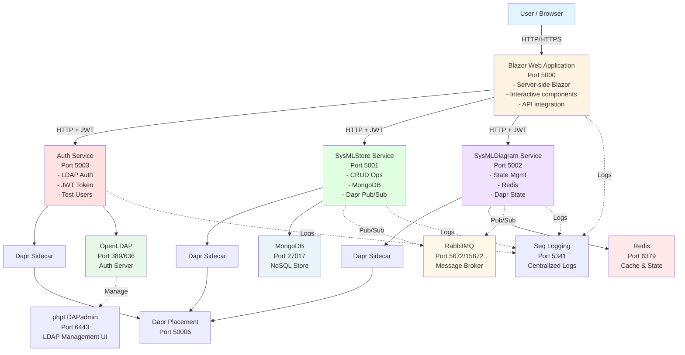
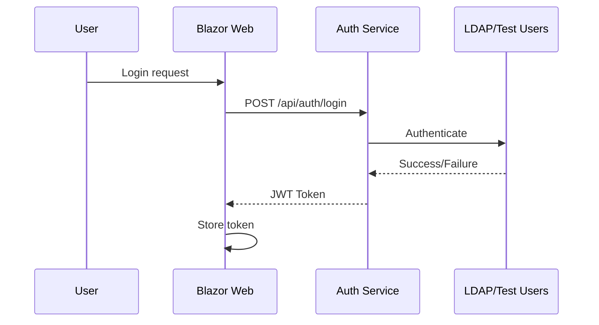
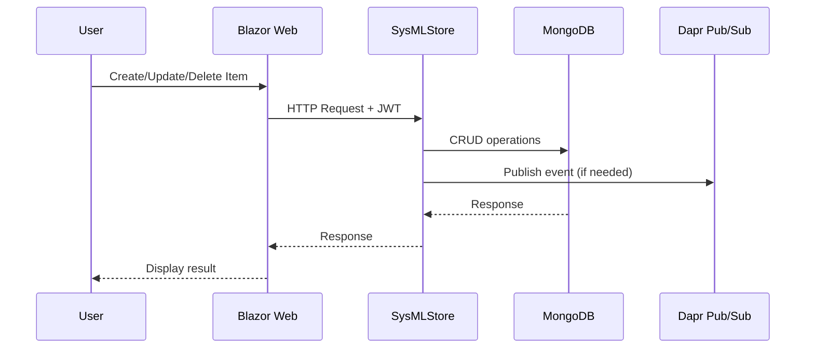
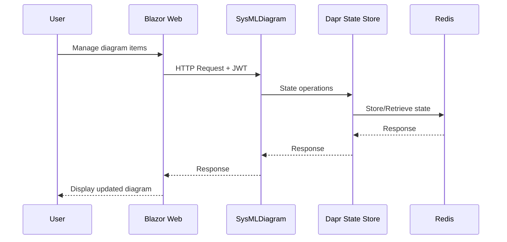

# SysArx Architecture

## System Overview



## Service Communication

### Synchronous Communication
- **HTTP/REST**: Blazor Web → APIs
- **Dapr Service Invocation**: Inter-service calls

### Asynchronous Communication
- **Dapr Pub/Sub with RabbitMQ**: Event-driven messaging
- **Dapr State Store with Redis**: Distributed state management

## Data Flow

### Authentication Flow


### SysML Item Management Flow


### Diagram Management Flow


## Dapr Components

### State Store (Redis)
```yaml
Component: statestore
Type: state.redis
Used By: SysMLDiagram API
Purpose: Distributed state management for diagrams
```

### Pub/Sub (RabbitMQ)
```yaml
Component: pubsub
Type: pubsub.rabbitmq
Used By: All services
Purpose: Event-driven communication
```

### Secret Store
```yaml
Component: secretstore
Type: secretstores.local.file
Used By: All services
Purpose: Configuration secrets management
```

## Security Architecture

### Authentication
- **Development Mode**: In-memory test users
- **Production Mode**: LDAP integration
- **Token Type**: JWT (JSON Web Tokens)
- **Token Expiration**: 60 minutes (configurable)

### Authorization
- Role-based access control via JWT claims
- Group membership from LDAP

### Transport Security
- HTTPS in production
- TLS for LDAP connections

## Scalability Considerations

### Horizontal Scaling
- All services are stateless (except state stored in Redis/MongoDB)
- Can scale services independently
- Dapr handles service discovery

### Data Storage
- MongoDB: Horizontally scalable NoSQL
- Redis: Can be clustered for high availability
- RabbitMQ: Can be clustered for reliability

### Load Balancing
- Docker Compose: Single instance
- Kubernetes: Built-in load balancing (future)

## Deployment Options

### Development
1. **Local Development**: Run services individually with `dotnet run`
2. **Docker Compose**: Run complete stack with `docker-compose up`

### Production (Future)
1. **Kubernetes**: Deploy with Helm charts
2. **Azure Container Apps**: Managed Dapr + containers
3. **AWS ECS/EKS**: Container orchestration

## Monitoring & Observability

### Logging
- **Seq**: Centralized structured logging
- All services configured with Serilog
- Correlation IDs for request tracing

### Health Checks
- `/hc`: Detailed health status
- `/liveness`: Simple liveness probe
- Used by orchestrators for service management

### Metrics (Future Enhancement)
- Prometheus metrics endpoint
- Grafana dashboards
- Application Insights integration

## Technology Stack

### Backend Services
- **.NET 10.0**: Runtime framework
- **ASP.NET Core**: Web framework
- **Dapr 1.14.4**: Distributed application runtime

### Data Stores
- **MongoDB 3.2**: NoSQL database
- **Redis**: In-memory data store
- **RabbitMQ**: Message broker

### Authentication
- **OpenLDAP**: LDAP server
- **System.DirectoryServices.Protocols**: LDAP client
- **JWT**: Token-based authentication

### Frontend
- **Blazor Server**: Interactive web UI
- **.NET 10.0**: Framework

### DevOps
- **Docker & Docker Compose**: Containerization
- **Seq**: Logging platform
- **Swagger/OpenAPI**: API documentation

## Design Patterns

### Microservices Patterns
- **Database per Service**: Each service owns its data
- **API Gateway**: Future enhancement
- **Service Discovery**: Via Dapr
- **Circuit Breaker**: Via Dapr resiliency

### Domain-Driven Design
- **Aggregates**: SysMLItem, Diagram
- **Repositories**: Service layer abstractions
- **Domain Events**: Via Dapr Pub/Sub

### CQRS (Future Enhancement)
- Separate read/write models
- Event sourcing for audit trail
