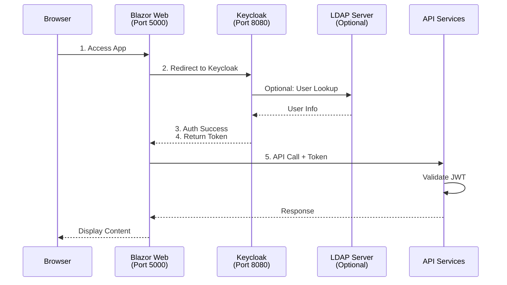

# Keycloak Setup Guide

This guide explains how to configure Keycloak SSO with LDAP integration for SysArx.

## Overview

SysArx supports two authentication modes:
- **Local Development Mode**: Uses in-memory test users or direct LDAP connection
- **Production Mode**: Uses Keycloak SSO with optional LDAP federation

## Quick Start

### 1. Start Keycloak

Keycloak is included in the docker-compose.yml file:

```bash
docker-compose up -d keycloak keycloak-db
```

Access Keycloak at `http://localhost:8080`
- Username: `admin`
- Password: `admin`

### 2. Create Realm

1. Click on the dropdown in the top-left (currently showing "master")
2. Click "Create realm"
3. Enter realm name: `SysArxRealm`
4. Click "Create"

### 3. Create API Client (Backend)

1. Navigate to **Clients** → **Create client**
2. Configure:
   - **Client type**: OpenID Connect
   - **Client ID**: `sysarx-api`
   - **Name**: SysArx API
3. Click **Next**
4. Configure capabilities:
   - **Client authentication**: OFF
   - **Authorization**: OFF
   - **Standard flow**: OFF
   - **Direct access grants**: OFF
5. Click **Save**

### 4. Create Client Scope for API Audience

1. Navigate to **Client scopes** → **Create client scope**
2. Configure:
   - **Name**: `sysarx_api_scope`
   - **Type**: Optional
   - **Include in token scope**: ON
3. Click **Save**
4. Go to **Mappers** tab → **Configure a new mapper**
5. Select **Audience**
6. Configure:
   - **Name**: `sysarx_api_audience`
   - **Included Client Audience**: `sysarx-api`
   - **Add to ID token**: OFF
   - **Add to access token**: ON
7. Click **Save**

### 5. Create Blazor Client (Frontend)

1. Navigate to **Clients** → **Create client**
2. Configure:
   - **Client type**: OpenID Connect
   - **Client ID**: `sysarx-blazor`
   - **Name**: SysArx Blazor Web
3. Click **Next**
4. Configure capabilities:
   - **Client authentication**: OFF (public client)
   - **Authorization**: OFF
   - **Standard flow**: ON
   - **Direct access grants**: OFF
   - **Implicit flow**: OFF
5. Click **Next**
6. Configure access settings:
   - **Valid redirect URIs**: `http://localhost:5000/*`
   - **Valid post logout redirect URIs**: `http://localhost:5000/*`
   - **Web origins**: `http://localhost:5000`
7. Click **Save**

### 6. Add API Scope to Blazor Client

1. Open the `sysarx-blazor` client
2. Go to **Client scopes** tab
3. Click **Add client scope**
4. Select `sysarx_api_scope`
5. Choose **Optional**
6. Click **Add**

### 7. Create Test User

1. Navigate to **Users** → **Create new user**
2. Configure:
   - **Username**: `testuser`
   - **Email**: `testuser@sysarx.local`
   - **First name**: `Test`
   - **Last name**: `User`
   - **Email verified**: ON
3. Click **Create**
4. Go to **Credentials** tab
5. Click **Set password**
6. Enter password: `test123`
7. Set **Temporary**: OFF
8. Click **Save**

## LDAP Integration (Production)

### Configure LDAP User Federation

1. Navigate to **User federation** → **Add LDAP provider**
2. Configure connection:
   - **Console Display Name**: `Corporate LDAP`
   - **Vendor**: `Active Directory` or `Other`
   - **Connection URL**: `ldap://your-ldap-server:389`
   - **Bind type**: `simple`
   - **Bind DN**: `cn=admin,dc=company,dc=com`
   - **Bind credential**: Your LDAP admin password
3. Configure LDAP search:
   - **Users DN**: `ou=users,dc=company,dc=com`
   - **Username LDAP attribute**: `uid` or `sAMAccountName`
   - **RDN LDAP attribute**: `uid` or `cn`
   - **UUID LDAP attribute**: `entryUUID` or `objectGUID`
   - **User Object Classes**: `inetOrgPerson, organizationalPerson`
4. Click **Test connection** and **Test authentication**
5. Click **Save**
6. Click **Synchronize all users**

### LDAP Mappers

After creating the LDAP provider, configure mappers:

1. **Email Mapper**:
   - Type: `user-attribute-ldap-mapper`
   - User Model Attribute: `email`
   - LDAP Attribute: `mail`

2. **First Name Mapper**:
   - Type: `user-attribute-ldap-mapper`
   - User Model Attribute: `firstName`
   - LDAP Attribute: `givenName`

3. **Last Name Mapper**:
   - Type: `user-attribute-ldap-mapper`
   - User Model Attribute: `lastName`
   - LDAP Attribute: `sn`

## Application Configuration

### Enable Keycloak Mode

Update `appsettings.json` or use environment variables:

#### API Services (SysMLStore, SysMLDiagram, Auth)

```json
{
  "KeycloakSettings": {
    "UseKeycloak": true,
    "Authority": "http://localhost:8080/realms/SysArxRealm",
    "Audience": "sysarx-api",
    "MetadataAddress": "http://localhost:8080/realms/SysArxRealm/.well-known/openid-configuration",
    "RequireHttpsMetadata": false
  }
}
```

#### Blazor Web App

```json
{
  "KeycloakSettings": {
    "UseKeycloak": true,
    "Authority": "http://localhost:8080/realms/SysArxRealm",
    "ClientId": "sysarx-blazor",
    "ClientSecret": "",
    "RequireHttpsMetadata": false
  }
}
```

### Production Configuration

For production, update these settings:

1. **Use HTTPS**: Set `RequireHttpsMetadata` to `true`
2. **Update Authority**: Use your production Keycloak URL
3. **Valid Redirect URIs**: Update to production URLs
4. **Client Secret**: Generate and configure for confidential clients
5. **Configure LDAP**: Point to corporate LDAP server

Example production configuration:

```json
{
  "KeycloakSettings": {
    "UseKeycloak": true,
    "Authority": "https://auth.yourdomain.com/realms/SysArxRealm",
    "Audience": "sysarx-api",
    "RequireHttpsMetadata": true
  }
}
```

## Testing

### Test with Local Users

1. Start all services:
   ```bash
   docker-compose up -d
   ```

2. Navigate to `http://localhost:5000`
3. Click Login (if Keycloak mode is enabled)
4. Enter credentials: `testuser` / `test123`
5. You should be authenticated

### Test with LDAP Users

1. Configure LDAP federation in Keycloak
2. Synchronize users
3. Login with LDAP credentials
4. Verify user attributes are mapped correctly

### Verify Token

After authentication, inspect the JWT token:

1. Open browser developer tools
2. Go to Application → Session Storage
3. Find the `oidc` keys
4. Copy the access token
5. Decode at https://jwt.io
6. Verify:
   - `iss`: Should match your Authority URL
   - `aud`: Should contain `sysarx-api`
   - `preferred_username`: Your username
   - `email`: Your email
   - `realm_access.roles`: Your assigned roles

## Troubleshooting

### Token Validation Fails

**Problem**: APIs return 401 Unauthorized

**Solutions**:
1. Check that `UseKeycloak` is set to `true` in all API services
2. Verify `Authority` and `Audience` match exactly
3. Check Keycloak logs: `docker logs sysarx-keycloak`
4. Verify realm and client IDs are correct

### LDAP Connection Fails

**Problem**: Cannot connect to LDAP server

**Solutions**:
1. Test LDAP connection from Keycloak admin
2. Verify firewall allows LDAP port (389/636)
3. Check Bind DN and credentials
4. Verify LDAP server is running: `docker ps | grep openldap`

### Redirect URI Mismatch

**Problem**: "Invalid redirect_uri" error

**Solutions**:
1. Add exact redirect URI to Blazor client config
2. Include wildcard: `http://localhost:5000/*`
3. Check Web Origins includes base URL

### Users Not Syncing from LDAP

**Problem**: LDAP users not appearing in Keycloak

**Solutions**:
1. Click "Synchronize all users" in LDAP provider
2. Check LDAP search base DN is correct
3. Verify user object classes match
4. Check Keycloak logs for sync errors

## Architecture



## Local Development vs Production

| Feature | Local Development | Production |
|---------|------------------|------------|
| **Auth Mode** | Test users or direct LDAP | Keycloak SSO |
| **User Store** | In-memory / Local LDAP | Keycloak + LDAP Federation |
| **HTTPS** | Optional | Required |
| **Token Issuer** | Custom JWT | Keycloak |
| **User Management** | Code-based test users | Keycloak Admin Console |
| **Password Policy** | None | Keycloak policies |
| **MFA** | Not available | Keycloak OTP |
| **Session Management** | Simple | Keycloak SSO sessions |

## Additional Resources

- [Keycloak Documentation](https://www.keycloak.org/documentation)
- [OpenID Connect Specification](https://openid.net/connect/)
- [LDAP User Federation](https://www.keycloak.org/docs/latest/server_admin/#_ldap)
- [Securing Applications](https://www.keycloak.org/docs/latest/securing_apps/)
