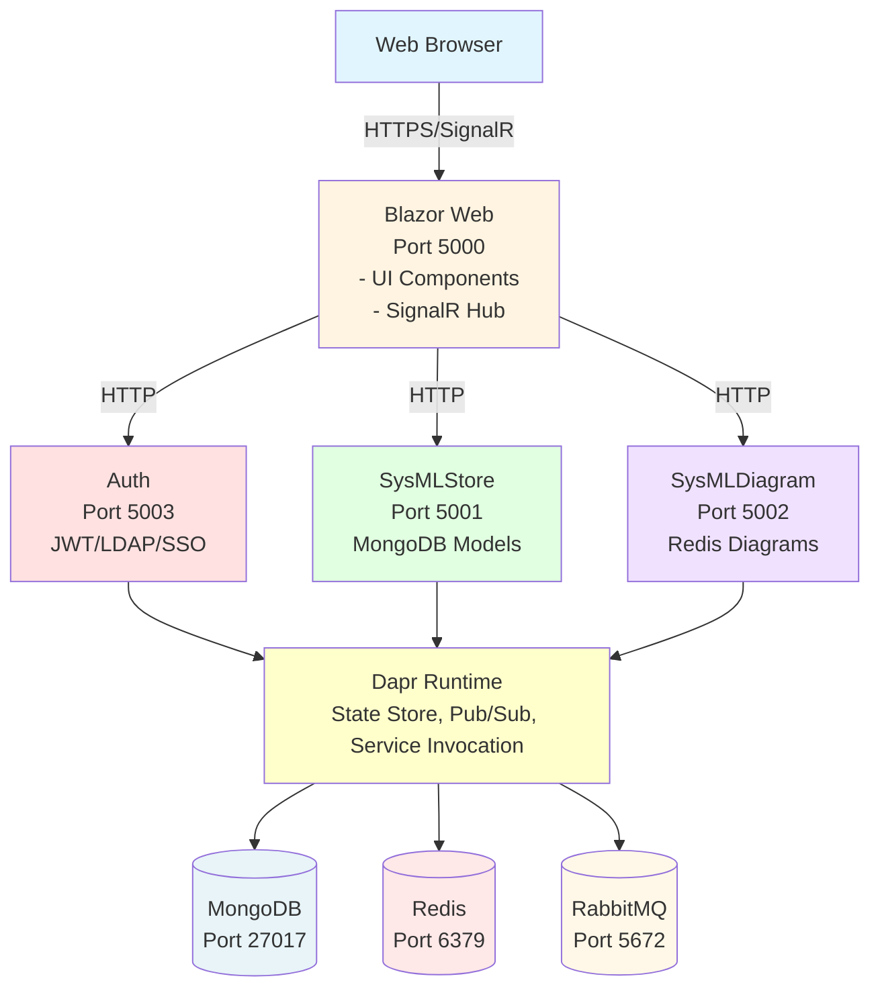
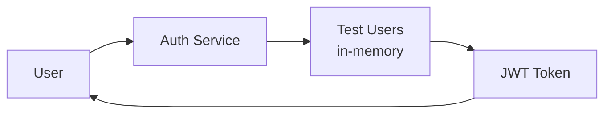
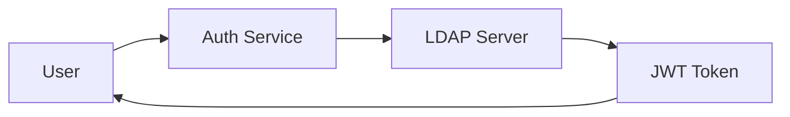
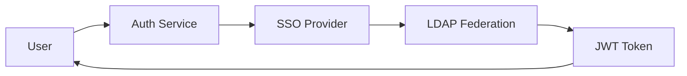
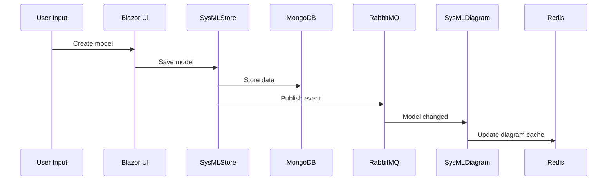
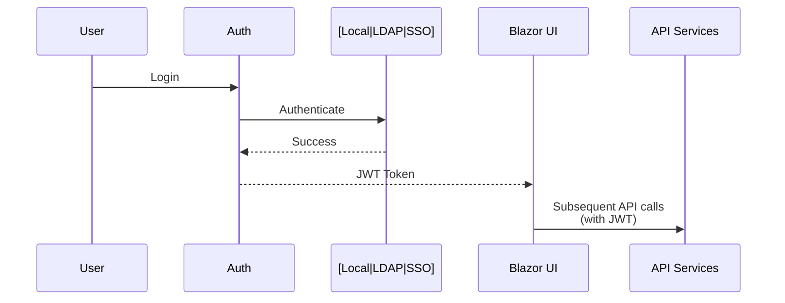

# SysArx Architecture

🎯 **You are here**: Architecture | [← Contributing](CONTRIBUTING.md) | [Traceability →](TRACEABILITY.md)

---

## System Overview

SysArx is a microservices-based SysML v2 modeling platform deployed via Docker containers.

**Key Principles**:
- Microservices for scalability
- Docker-first deployment
- Event-driven communication (Dapr)
- Flexible authentication (Local, LDAP, SSO)

---

## Service Architecture



---

## Component Descriptions

### Blazor Web (Frontend)
- **Technology**: Blazor Server, .NET 10
- **Port**: 5000
- **Purpose**: Interactive UI for SysML modeling
- **Communication**: SignalR WebSocket to backend

### Auth
- **Port**: 5003
- **Purpose**: Authentication service
- **Modes**: Local (test users), LDAP (enterprise), LdapSSO (SSO provider)
- **Output**: JWT tokens for API authorization

### SysMLStore
- **Port**: 5001
- **Purpose**: Model persistence
- **Database**: MongoDB (document storage)
- **Features**: CRUD operations, model versioning

### SysMLDiagram
- **Port**: 5002
- **Purpose**: Diagram generation
- **Cache**: Redis via Dapr
- **Features**: Generate diagrams from models

---

## Authentication Architecture

Three deployment modes (see [AUTHENTICATION_REFACTORING.md](../docs/AUTHENTICATION_REFACTORING.md)):

### Local Mode
### Local Mode


### LDAP Mode


### LdapSSO Mode


---

## Data Flow

### Model Creation


### Authentication


---

## Technology Stack

| Component | Technology | Version | Purpose |
|-----------|-----------|---------|---------|
| Runtime | .NET | 10.0 | Application framework |
| Frontend | Blazor Server | 10.0 | Interactive UI |
| Database | MongoDB | 5.0+ | Model storage |
| Cache | Redis | 7.0+ | State/diagram cache |
| Message Bus | RabbitMQ | 3.12+ | Event messaging |
| Service Mesh | Dapr | 1.14.4 | Microservices runtime |
| SSO (optional) | Keycloak | 26.1.1 | Identity provider |
| Logging | Seq | Latest | Centralized logs |

---

## Deployment

Docker Compose orchestrates all services:

```yaml
services:
  web: Blazor frontend
  auth-api: Authentication
  sysmlstore-api: Model storage
  sysmldiagram-api: Diagram generation
  mongodb: Database
  redis: Cache
  rabbitmq: Message broker
  keycloak: SSO (optional)
  seq: Logging
```

Single command: `docker-compose up -d`

---

## Security

- **Authentication**: JWT tokens (1-hour expiration)
- **Authorization**: Role-based from auth provider
- **Transport**: HTTPS in production
- **Secrets**: Environment variables, no hardcoded credentials
- **LDAP**: Encrypted bind (LDAPS)
- **SSO**: OpenID Connect with PKCE

---

## Scalability

- **Horizontal**: Multiple instances behind load balancer
- **Database**: MongoDB sharding for large datasets
- **Cache**: Redis clustering
- **State**: Dapr state management for distributed state

---

## References

- eShopOnDapr: Microservices inspiration
- INCOSE SE Handbook: Requirements structure
- OMG SysML v2 Spec: Model semantics

---

**Navigation**: [← Contributing](CONTRIBUTING.md) | [Traceability →](TRACEABILITY.md) | [Requirements →](REQUIREMENTS.md)
