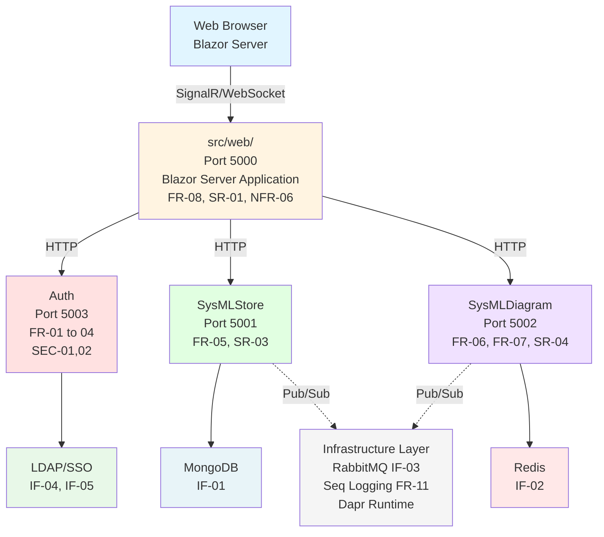

# Requirements Traceability

🎯 **You are here**: Implementation Mapping | [← Matrix](REQUIREMENTS_MATRIX.md) | [V&V →](VERIFICATION_VALIDATION.md)

---

## Requirements to Implementation Map

### Authentication System (FR-01, FR-02, FR-03, FR-04, SEC-01, SEC-02)

**Requirements**: FR-01 (Local), FR-02 (LDAP), FR-03 (SSO), FR-04 (Mode Switching), SEC-01, SEC-02

**Implementation**:
- `src/BuildingBlocks/Authentication/`
  - `Settings/AuthenticationSettings.cs` - Configuration model with AuthenticationMode enum
  - `Services/LdapService.cs` - Local test users + LDAP auth + SSO delegation
  - `Extensions/AuthenticationExtensions.cs` - Mode-aware DI registration
- `src/Services/Auth/` - Authentication API service
- Configuration: `config/appsettings.{Local|Ldap|LdapSSO}.json`

**Tests**: `tests/SysArx.Tests/AuthenticationTests.cs`

**Architecture Decision**: Single authentication building block supporting three modes via configuration rather than separate implementations. Reduces code duplication and simplifies maintenance.

---

### Model Storage (FR-05, SR-03, IF-01)

**Requirements**: FR-05 (NoSQL Storage), SR-03 (Persistence), IF-01 (Document Database)

**Implementation Solution**: MongoDB 5.0+
- `src/Services/SysMLStore/` - Model storage service
  - MongoDB .NET driver for document storage
  - CRUD endpoints for .sysml files and model elements
  - Dapr state management abstraction
- `docker-compose.yml` - MongoDB container service definition

**Rationale**: MongoDB chosen for schema flexibility suitable for evolving SysML v2 models. Document-oriented storage maps naturally to .sysml file structure.

**Tests**: `tests/SysArx.Tests/ModelStorageTests.cs`

**Architecture Decision**: MongoDB for document storage with Dapr abstraction layer enabling future state store migration if needed.

---

### Diagram Generation (FR-06, FR-07, SR-04, IF-02)

**Requirements**: FR-06 (SysML Parsing), FR-07 (SysML Diagram Types), SR-04 (Visualization), IF-02 (State Store)

**Implementation Solution**: Redis + Custom SysML Renderer
- `src/Services/SysMLDiagram/` - Diagram generation service
  - Redis for caching rendered diagrams via Dapr
  - SysML v2 parser for .sysml files
  - Diagram rendering for all SysML v2 diagram types: bdd, ibd, par, pkg, act, sd, stm, uc, req, and Allocation Tables
  - Allocation Table generator
- `docker-compose.yml` - Redis container service definition

**Rationale**: Redis provides sub-millisecond caching for frequently accessed diagrams. Distributed state store supports horizontal scaling.

**Tests**: `tests/SysArx.Tests/DiagramTests.cs`

---

### User Interface (FR-08, SR-01, NFR-06)

**Requirements**: FR-08 (Interactive Web UI), SR-01 (Browser-Based), NFR-06 (Learning Curve)

**Implementation Solution**: Blazor Server (.NET 10.0)
- `src/web/` - Blazor Server application
  - `Components/Pages/` - Page components for model editing
  - `Components/Layout/` - Layout components with navigation
  - `Program.cs` - Application bootstrap with SignalR
  - Real-time UI updates via WebSocket

**Rationale**: Blazor Server enables rich C# interactivity without JavaScript complexity. SignalR provides real-time collaboration foundation.

**Tests**: Manual UI testing + `tests/SysArx.Tests/UiTests.cs`

---

### Message Queue (IF-03)

**Requirements**: IF-03 (Async Messaging)

**Implementation Solution**: RabbitMQ
- `docker-compose.yml` - RabbitMQ container with management UI
- Dapr pub/sub component for event-driven architecture
- Used for: Model change events, diagram regeneration triggers

**Rationale**: RabbitMQ provides reliable message delivery with dead-letter queues. Dapr pub/sub enables cloud-agnostic messaging.

**Tests**: `tests/SysArx.Tests/IntegrationTests.cs`

---

### API Endpoints (FR-09)

**Requirements**: FR-09 (RESTful APIs)

**Implementation**:
- All services expose Swagger/OpenAPI documentation
- Standard HTTP status codes
- JSON request/response format
- Health check endpoints at `/health`

**Tests**: `tests/SysArx.Tests/ApiTests.cs`

---

### Configuration Management (FR-10, DEP-02, DEP-04)

**Requirements**: FR-10 (Configuration), DEP-02 (Environment Config), DEP-04 (Logging Config)

**Implementation**:
- `appsettings.json` - Base configuration
- `appsettings.{Environment}.json` - Environment overrides
- Environment variables for secrets
- Standard .NET configuration system

**Tests**: `tests/SysArx.Tests/ConfigurationTests.cs`

---

### Logging (FR-11, DEP-04)

**Requirements**: FR-11 (Structured Logging), DEP-04 (Configurable Logging)

**Implementation Solution**: Seq
- Centralized log aggregation via Seq container
- Structured logging with Serilog
- `docker-compose.yml` - Seq service with web UI
- All services configured to send logs to Seq endpoint

**Rationale**: Seq provides powerful structured log querying and real-time monitoring. Free for single-user development, scalable for production.

**Tests**: `tests/SysArx.Tests/LoggingTests.cs`

---

### Performance (NFR-01, NFR-02, NFR-03, SR-05)

**Requirements**: NFR-01 (Page Load), NFR-02 (API Response), NFR-03 (Concurrent Users), SR-05 (Performance)

**Implementation**:
- Blazor Server for efficient rendering
- Redis caching via Dapr
- Async/await throughout codebase
- Connection pooling for MongoDB

**Tests**: `tests/SysArx.Tests/PerformanceTests.cs` (load testing)

---

### Infrastructure Interfaces (IF-02, IF-03, IF-04, IF-05)

**Requirements**: IF-02 (State Store), IF-03 (Message Queue), IF-04 (LDAP), IF-05 (OIDC)

**Implementation Solutions**:
- **IF-02 State Store**: Redis via Dapr sidecar
  - Dapr state component configuration in `dapr/components/statestore.yaml`
  - Used for session state and diagram caching
- **IF-03 Message Queue**: RabbitMQ via Dapr pub/sub
  - Dapr pubsub component configuration in `dapr/components/pubsub.yaml`
  - Event-driven communication between services
- **IF-04 LDAP**: Any LDAPv3-compliant directory server
  - Novell.Directory.Ldap.NETStandard client library
  - Tested with OpenLDAP, Active Directory, 389 Directory Server
- **IF-05 OpenID Connect**: Keycloak (or any OIDC 1.0 provider)
  - Microsoft.AspNetCore.Authentication.OpenIdConnect middleware
  - Works with Keycloak, Okta, Azure AD, Auth0

**Infrastructure**: `docker-compose.yml` - All infrastructure containers

**Tests**: `tests/SysArx.Tests/IntegrationTests.cs`

---

### Security (SEC-01 through SEC-06)

**Requirements**: All SEC-XX requirements

**Implementation Solutions**:
- **SEC-02 Tokens**: JWT (JSON Web Tokens) with HS256/RS256 signing
- **SEC-03 Transport**: HTTPS with TLS 1.2+ certificates
- All APIs use JWT Bearer authentication middleware
- HTTPS redirect enforced in production appsettings
- No local password storage (delegated auth only)
- Environment variable secret loading via .NET Configuration
- Authorization policies with role claims

**Tests**: `tests/SysArx.Tests/SecurityTests.cs`

---

### Deployment (DEP-01, DEP-03, DEP-05, NFR-07)

**Requirements**: DEP-01 (Container Orchestration), DEP-03 (Health Checks), DEP-05 (Multi-Arch), NFR-07 (Container Deployment)

**Implementation Solutions**:
- **DEP-01 Orchestration**: Docker Compose for local/dev, Kubernetes-ready for production
- **DEP-05 Multi-Architecture**: Docker Buildx for AMD64 + ARM64 images
- `docker-compose.yml` - Complete stack definition with all services
- Dockerfiles for all .NET services
- Health check endpoints using ASP.NET Core Health Checks
- CI/CD pipeline with multi-architecture builds

**Tests**: `tests/SysArx.Tests/DeploymentTests.cs`

---

### Technology Stack (CON-01)

**Constraint**: CON-01 (Modern web framework, NoSQL, state store, message queue, service mesh)

**Implementation Solutions**:
- **Web Framework**: .NET 10.0 with Blazor Server
- **NoSQL Database**: MongoDB 5.0+
- **State Store**: Redis 7.0+
- **Message Queue**: RabbitMQ 3.12+
- **Service Mesh**: Dapr 1.11+
- **Logging**: Seq for centralized logs
- **Authentication**: Keycloak for SSO (or any OIDC provider)

**Rationale**: All technologies chosen for maturity, performance, community support, and permissive licenses.

---

### Constraints (CON-02 through CON-04)

**Requirements**: CON-02 (Licenses), CON-03 (Browsers), CON-04 (SysML v2)

**Implementation**:
- .NET 10.0 project files
- License scanning in CI/CD
- Blazor browser compatibility
- SysML v2 model validation

**Tests**: `tests/SysArx.Tests/ComplianceTests.cs`

---

## Architecture Decisions

### AD-01: Three Authentication Modes
**Context**: Need to support local dev, enterprise LDAP, and SSO deployments  
**Decision**: Single authentication building block with mode enum (Local, Ldap, LdapSSO)  
**Rationale**: Reduces code duplication, simplifies configuration, easier testing  
**Consequences**: Slightly more complex service initialization, but much simpler to maintain

### AD-02: Microservices with Dapr
**Context**: Need scalable, maintainable architecture  
**Decision**: Microservices pattern with Dapr runtime  
**Rationale**: Service independence, easier scaling, pub/sub patterns  
**Consequences**: More complex deployment, but better scalability

### AD-03: MongoDB for Model Storage
**Context**: Need flexible storage for evolving SysML models  
**Decision**: MongoDB with document model  
**Rationale**: Schema flexibility, natural fit for hierarchical models  
**Consequences**: No strict schema enforcement, but flexibility for model evolution

### AD-04: Docker-First Deployment
**Context**: Need consistent deployment across environments  
**Decision**: Docker containers as primary deployment method  
**Rationale**: Platform independence, reproducible environments  
**Consequences**: Requires Docker knowledge, but ensures consistency

### AD-05: Blazor Server over Blazor WASM
**Context**: Need interactive UI with backend integration  
**Decision**: Blazor Server for initial implementation  
**Rationale**: Simpler deployment, better SEO, smaller initial download  
**Consequences**: Requires WebSocket connection, but acceptable for enterprise deployment

---

## Component Diagram



---

## File Organization

```
src/
├── BuildingBlocks/Authentication/     # FR-01 to 04, SEC-01, 02
├── Services/
│   ├── Auth/                     # Authentication service
│   ├── SysMLStore/               # FR-05, SR-03, IF-01
│   └── SysMLDiagram/             # FR-06, SR-04, IF-02
└── web/                              # FR-07, SR-01, NFR-06

tests/
└── SysArx.Tests/                     # All test requirements

project/
├── REQUIREMENTS.md                   # Source requirements
├── REQUIREMENTS_MATRIX.md            # V&V status
├── TRACEABILITY.md                   # This file
└── VERIFICATION_VALIDATION.md        # Test strategy

docker-compose.yml                    # DEP-01, IF-01 to 05
```

---

**Navigation**: [← Matrix](REQUIREMENTS_MATRIX.md) | [V&V →](VERIFICATION_VALIDATION.md) | [Tests →](../tests/SysArx.Tests/)
